# Full-Stack Chat App | DevSecOps CI/CD Pipeline | Jenkins + SonarQube + Trivy + Docker Hub + ArgoCD + Amazon EKS

---

## ⭐ Support the Project
If this **repository** helps you, give it a ⭐ to show your support and help others discover it!

---

## ⭐ Follow the below refferences for complete and environment steup and for application
If this **repository** helps you, give it a ⭐ to show your support and help others discover it!

---

## **Table of Contents**

* [Credits & Acknowledgements](#credits--acknowledgements)
* [Introduction](#introduction)
* [Tech Stack](#tech-stack)
* [Architecture Overview](#architecture-overview)
* [Pipeline Overview](#pipeline-overview)
  * [CI Pipeline — Chat-App-CI](#ci-pipeline--chat-app-ci)
  * [CD Pipeline — Chat-App-CD](#cd-pipeline--chat-app-cd)
* [Infrastructure](#infrastructure)
  * [Amazon EKS Cluster](#amazon-eks-cluster)
  * [EKS Architecture](#eks-architecture)
* [Code Quality — SonarQube](#code-quality--sonarqube)
  * [SonarQube Dashboard](#sonarqube-dashboard)
  * [Backend Issues](#backend-issues)
  * [Frontend Issues](#frontend-issues)
* [Docker Hub — Image Registry](#docker-hub--image-registry)
* [ArgoCD — GitOps Deployment](#argocd--gitops-deployment)
  * [ArgoCD Application Tree](#argocd-application-tree)
  * [ArgoCD Pods & Deployments](#argocd-pods--deployments)
* [Application Demo](#application-demo)
  * [Login Page](#login-page)
  * [Chat Interface](#chat-interface)
* [Jenkins Dashboard](#jenkins-dashboard)
* [Email Notifications](#email-notifications)
* [How to Improve This Pipeline](#how-to-improve-this-pipeline)
* [Conclusion](#conclusion)
* [References](#references)

---

# **Credits & Acknowledgements**

This project is built by combining the work of two excellent YouTubers and educators. Full credit goes to them for the foundational content used in this repository.

---

### 🛠️ Environment Setup & CI/CD Pipeline — CloudWithVarJosh

The complete DevSecOps environment setup, Jenkins CI/CD pipeline architecture, SonarQube integration, Trivy scanning, ArgoCD, and EKS deployment strategy in this project is based on **Project 01** from the **Jenkins – Basics to Production** series by [CloudWithVarJosh](https://github.com/CloudWithVarJosh).

* **GitHub (Project 01):** [https://github.com/CloudWithVarJosh/Jenkins-Basics-To-Production.git](https://github.com/CloudWithVarJosh/Jenkins-Basics-To-Production.git)
* **YouTube Channel:** [CloudWithVarJosh on YouTube](https://www.youtube.com/@CloudWithVarJosh)

The Jenkins Basics to Production series covers everything from fundamentals to production-grade CI/CD pipelines, Jenkinsfiles, multi-branch pipelines, and real-world DevOps/SRE practices. If you want to understand any part of the pipeline setup in this repo, that series is the place to start.

---

### 💬 Application — LondheShubham153 (Shubham Londhe)

The full-stack chat application (**Chatty**) used in this project is sourced from the repository by [LondheShubham153](https://github.com/LondheShubham153), which is a fork of the original by [iemafzalhassan](https://github.com/iemafzalhassan).

* **GitHub (Application):** [https://github.com/LondheShubham153/full-stack_chatApp](https://github.com/LondheShubham153/full-stack_chatApp)
* **YouTube Channel:** [Train With Shubham on YouTube](https://www.youtube.com/@TrainWithShubham)

The application is a scalable, real-time chat experience built with React (frontend), Node.js/Express (backend), and MongoDB. It supports real-time messaging via WebSockets, user authentication, and online presence indicators.

---

> **Note:** This repository is a personal learning project. The pipeline setup and the application were taken from the above sources and combined together for hands-on DevSecOps practice. All intellectual credit belongs to the original authors.

---

---

# **Introduction**

This project implements a **production-grade DevSecOps CI/CD pipeline** for a full-stack real-time chat application called **Chatty**. The application consists of a React frontend and a Node.js backend, backed by MongoDB.

The pipeline automates everything from code commit to secure container deployment on Amazon EKS, integrating:

* **Jenkins** for CI/CD orchestration (separate CI and CD pipelines)
* **SonarQube** for static code analysis (SAST) and quality gate enforcement
* **Trivy** for filesystem and container image vulnerability scanning (SCA)
* **Docker Hub** as the container image registry
* **ArgoCD** for GitOps-based continuous delivery to Kubernetes
* **Amazon EKS** for scalable, managed Kubernetes hosting

The pipeline reflects **real-world production DevSecOps patterns** used by modern engineering teams, ensuring every artifact is scanned, validated, and deployed in a controlled and observable manner.

---

# **Tech Stack**

| Layer | Technology |
|---|---|
| Frontend | React.js |
| Backend | Node.js / Express |
| Database | MongoDB |
| CI/CD | Jenkins (CI + CD pipelines) |
| SAST | SonarQube |
| SCA / Image Scan | Trivy |
| Container Registry | Docker Hub |
| GitOps | ArgoCD |
| Kubernetes | Amazon EKS (v1.32) |
| Cloud | AWS (EC2, EKS, VPC) |

---

# **Architecture Overview**

The high-level flow is:

1. Developer pushes code to GitHub
2. Jenkins CI pipeline triggers automatically
3. Code is scanned (Trivy FS), built, and analyzed (SonarQube)
4. Docker images for frontend and backend are built and get trivy scan and pushed to Docker Hub
5. Jenkins CD pipeline updates Kubernetes manifests with the new image tags
6. ArgoCD detects the change in the Git repo and syncs the application to EKS

---

# **Pipeline Overview**

## CI Pipeline — Chat-App-CI

The CI pipeline runs on every push/commit and includes the following stages:

1. **Validate Parameters** — Validates input parameters
2. **Git SCM Checkout** — Clones the source repository
3. **Trivy Scan** — Filesystem-level SCA scan for the whole repo \
   **Frontend Trivy Scan** — Targeted scan on the frontend directory \
   **Backend Trivy Scan** — Targeted scan on the backend directory
4. **SonarQube Analysis** — Runs SonarQube server analysis \
   **Frontend Sonar Scan** — Frontend-specific SAST analysis \
   **Backend Sonar Scan** — Backend-specific SAST analysis
5. **Quality Gates** — Enforces SonarQube quality gate (fails pipeline on breach)
6. **Docker Build** — Builds frontend and backend images
7. **Trivy Image Scan** — Targeted scan on the frontend and backend images
8. **Docker Push** — Pushes frontend and backend images to Docker Hub

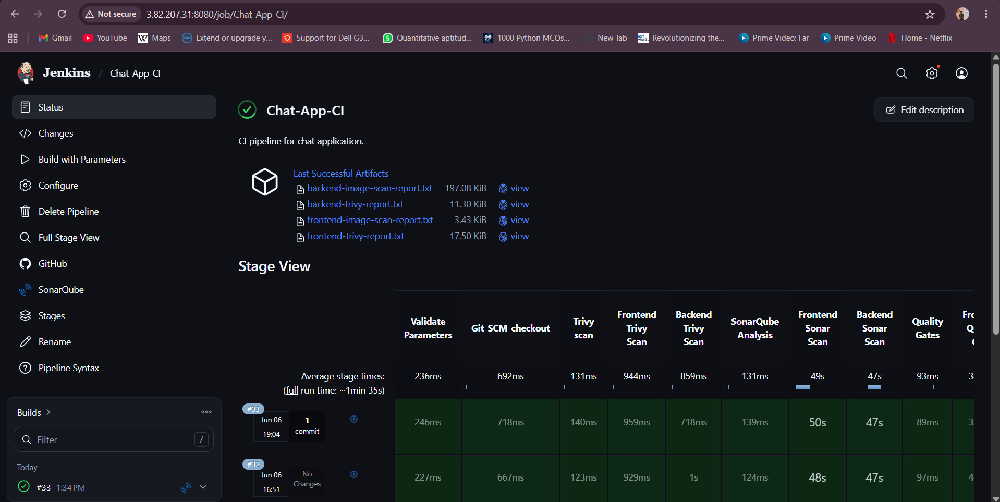

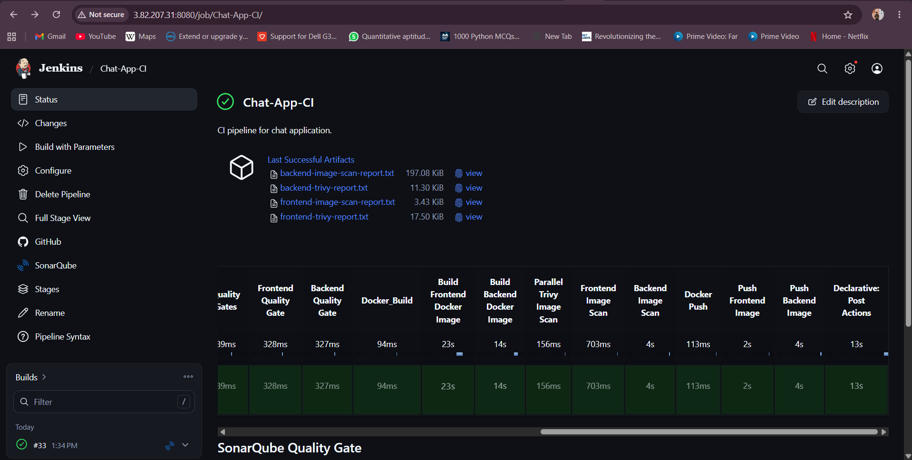

---

## CD Pipeline — Chat-App-CD

The CD pipeline is triggered after a successful CI run and handles deployment to EKS via ArgoCD:

1. **Validate Parameters** — Validates input parameters
2. **Git SCM Checkout** — Clones the Kubernetes manifest repository
3. **Verify: Docker Image Tag** — Confirms the new image tag is available on Docker Hub
4. **Update Kubernetes Manifests** — Replaces image tags in deployment manifests
5. **Print Kubernetes Manifests** — Logs the updated manifests for audit
6. **Git Commit & Push Changes** — Commits and pushes updated manifests back to Git
7. **Declarative: Post Actions** — Cleanup and notification steps

ArgoCD then auto-detects the manifest change and syncs the deployment to the EKS cluster.

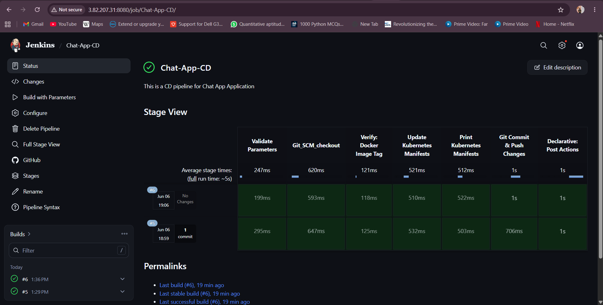

---

# **Infrastructure**

## Amazon EKS Cluster

The application runs on a dedicated EKS cluster named **devsecops-eks** with the following configuration:

* **Kubernetes version:** 1.32
* **Node group:** `Chatapp-node-group`
* **Instance type:** `t3.medium`
* **Nodes:** 2 worker nodes across availability zones
* **Status:** Active

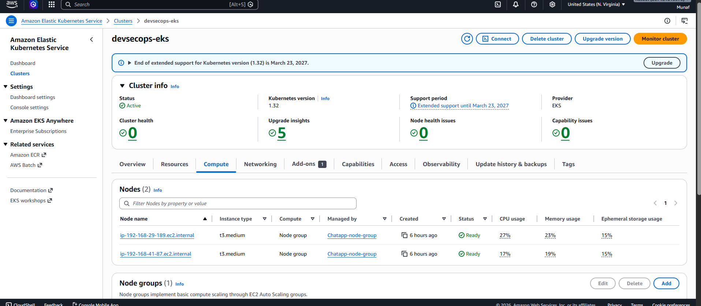

---

## EKS Architecture

The EKS control plane is fully managed by AWS and runs across multiple Availability Zones. The customer-managed data plane consists of EC2 worker nodes in an Auto Scaling group.

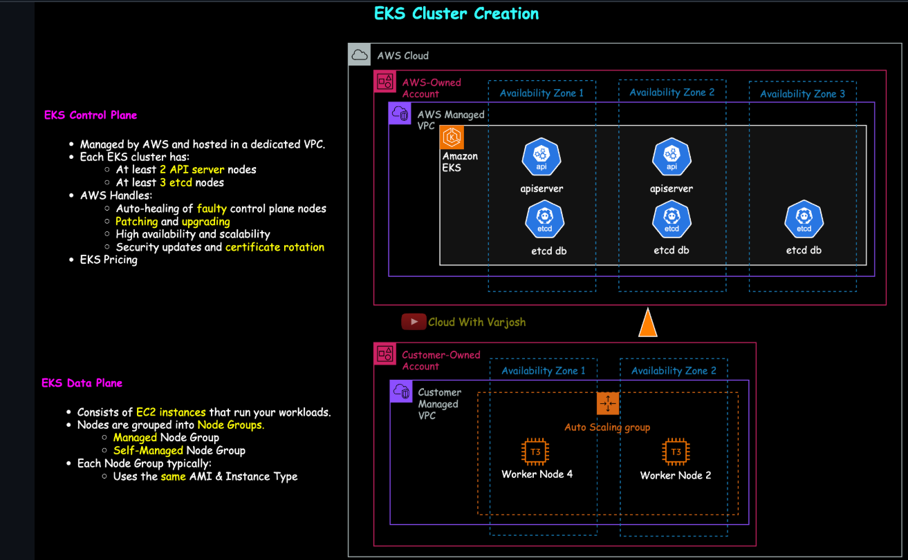

---

# **Code Quality — SonarQube**

## SonarQube Dashboard

Both the `frontend-chatapp` and `backend-chatapp` projects are analyzed on every CI run. Both projects pass the quality gate.

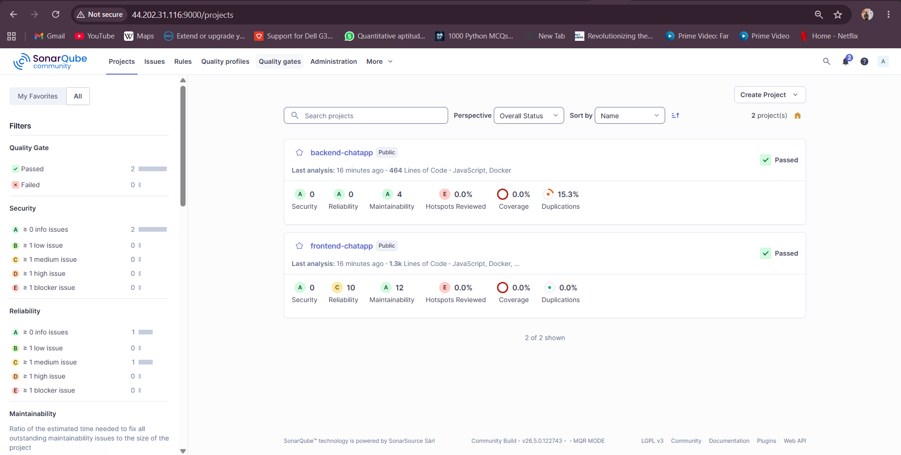

---

## Backend Issues

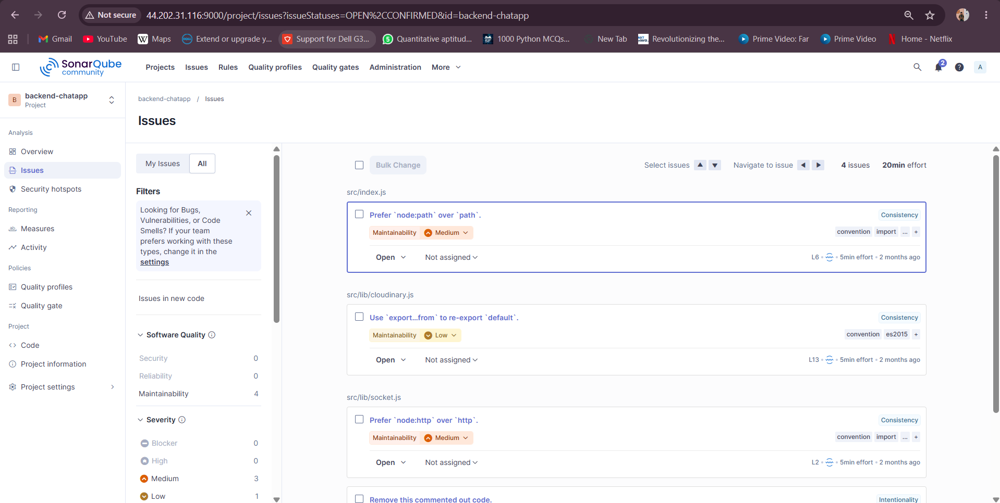

---

## Frontend Issues

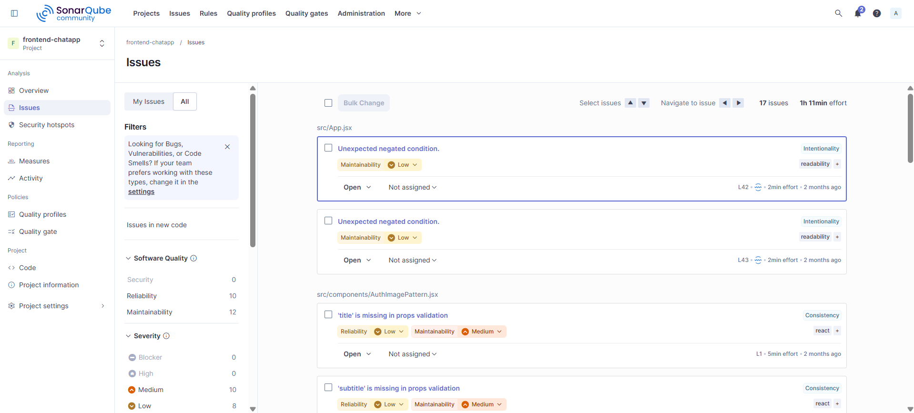

---

# **Docker Hub — Image Registry**

Both frontend and backend Docker images are published to Docker Hub under the `munafshaik` namespace:

* `munafshaik/chatapp-frontend`
* `munafshaik/chatapp-backend`

Images are versioned with the Jenkins `BUILD_NUMBER` and tagged as `latest` as well.

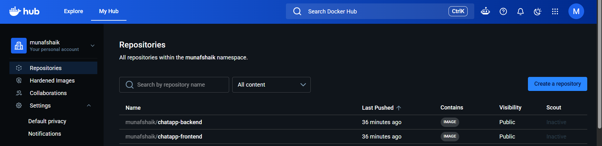

---

# **ArgoCD — GitOps Deployment**

ArgoCD manages the deployment of the Chatty application to EKS using a pull-based GitOps model. The application is named `chatapp` and manages the following Kubernetes resources:

* `chatapp-secrets` (Secret)
* `frontend` service and deployment
* `backend` service and deployment
* `mongodb` service and deployment
* `chatapp-ingress` (Ingress)

## ArgoCD Application Tree

The application is synced to the `main` branch and shows **Sync OK** with all 11 resources in a healthy state.

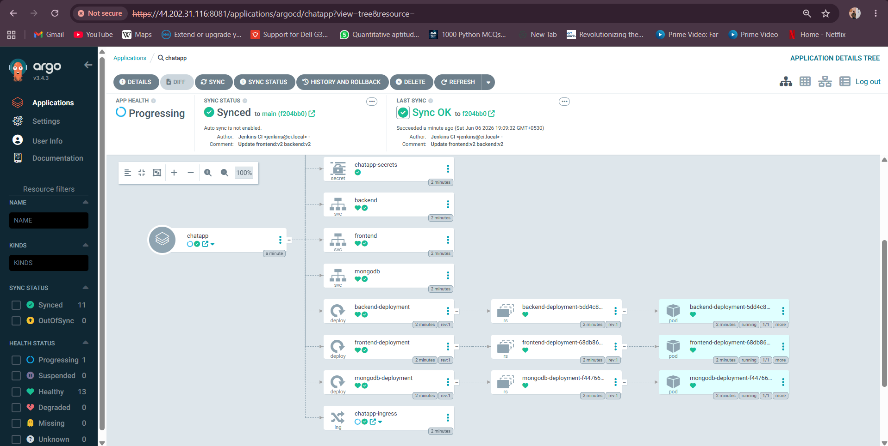

---

## ArgoCD Pods & Deployments

All ArgoCD system pods are running in the `argocd` namespace, confirming a healthy GitOps control plane.

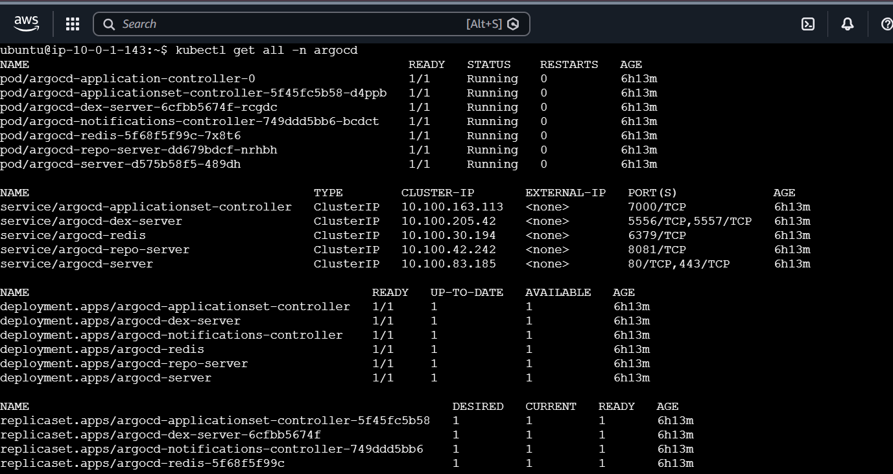

---

# **Application Demo**

## Login Page

The Chatty application is accessible via the EKS NodePort. Users can sign in or create an account.

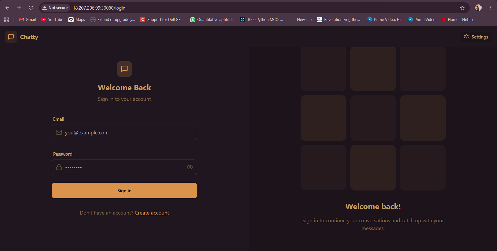

---

## Chat Interface

Once logged in, users can send and receive real-time messages. The interface shows online contacts and a live message stream.

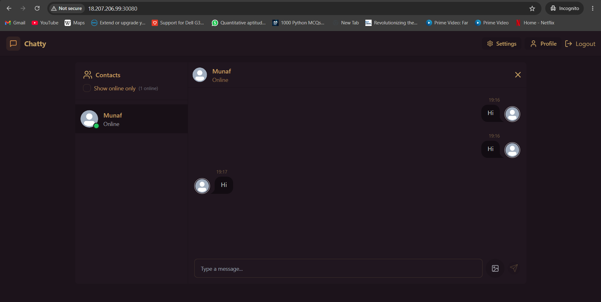

---

# **Jenkins Dashboard**

Both pipelines — `Chat-App-CI` and `Chat-App-CD` — are visible on the Jenkins home screen. Both show a green status with no failures, confirming a healthy pipeline state.

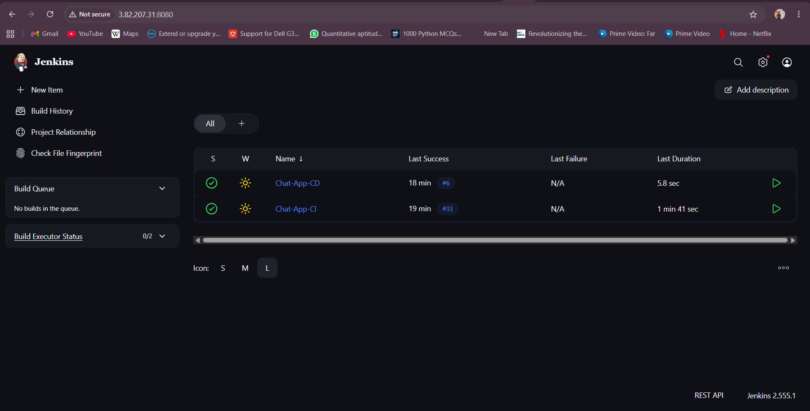

---

# **Email Notifications**

The pipeline sends email notifications on build completion, ensuring the team is notified of both success and failure outcomes.

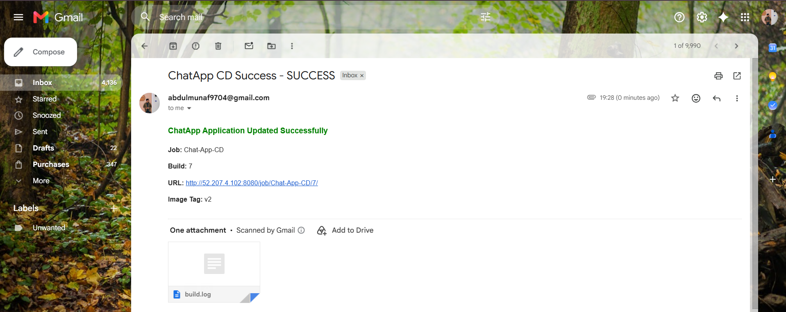

---

# **How to Improve This Pipeline**

The pipeline as implemented is intentionally straightforward to keep each component learnable in isolation. The following improvements bring it closer to enterprise-grade production standards:

**1. Multi-environment promotion** — Add staging and production namespaces with promotion gates between them rather than deploying directly to a single cluster.

**2. GitOps with ArgoCD ApplicationSets** — Use ApplicationSets to manage multi-cluster or multi-environment deployments from a single ArgoCD configuration, enabling proper environment-aware rollouts.

**3. Helm or Kustomize for manifest management** — Replace raw YAML manifests with Helm charts or Kustomize overlays to make deployments modular, version-controlled, and environment-aware.

**4. Image digest pinning** — Pull and deploy using SHA256 digests instead of tags. This guarantees the exact scanned, approved artifact is deployed and prevents tag drift.

**5. Signed images + admission control** — Sign images with Cosign and enforce signature verification using Kyverno or Gatekeeper policies on the cluster so only trusted images can run.

**6. Centralised secrets management** — Replace Jenkins credentials and Kubernetes Secrets with HashiCorp Vault or AWS Secrets Manager for dynamic, short-lived, auto-rotating secrets.

**7. Kubernetes Ingress with TLS** — Replace NodePort exposure with an Ingress controller (AWS Load Balancer Controller) with TLS termination and proper DNS names via Route53.

**8. Multibranch pipelines** — Auto-discover feature branches and pull requests, running CI checks on each and blocking merges until quality gates pass.

**9. Progressive delivery** — Introduce Argo Rollouts for canary or blue-green deployment strategies, enabling partial traffic shifting and automatic rollback on health failures.

**10. Observability** — Add build-number annotations to deployments and wire up Prometheus, Grafana, and CloudWatch for end-to-end build-to-runtime traceability.

**11. Policy-as-Code** — Insert Checkov or Conftest checks to validate Kubernetes manifests and Dockerfile configurations against security baselines before deployment.

**12. Automated cleanup** — Add steps to prune old Docker Hub tags, clear Jenkins workspaces, and remove stale Kubernetes resources to control storage costs.

---

# **Conclusion**

This project demonstrates a complete, working DevSecOps pipeline that secures and automates every stage of the software delivery lifecycle for a real full-stack application:

* Source-level security via SonarQube SAST on both frontend and backend
* Dependency and filesystem scanning with Trivy FS scans
* Container image vulnerability scanning with Trivy Image scan
* Versioned, immutable image storage on Docker Hub
* GitOps-driven deployment via ArgoCD synced to Amazon EKS
* Separate CI and CD pipelines for clean separation of concerns
* Email notifications for build outcomes

The result is a reproducible, auditable delivery pipeline that mirrors production DevSecOps patterns and can be extended with admission controllers, multi-cluster GitOps, progressive delivery, and enterprise secrets management.

---

# **References**

### Jenkins
* Declarative Pipeline Syntax: [https://www.jenkins.io/doc/book/pipeline/syntax/](https://www.jenkins.io/doc/book/pipeline/syntax/)
* Post Actions: [https://www.jenkins.io/doc/book/pipeline/syntax/#post](https://www.jenkins.io/doc/book/pipeline/syntax/#post)

### SonarQube
* SonarQube Documentation: [https://docs.sonarsource.com/sonarqube](https://docs.sonarsource.com/sonarqube)
* Quality Gates: [https://docs.sonarsource.com/sonarqube/latest/user-guide/quality-gates/](https://docs.sonarsource.com/sonarqube/latest/user-guide/quality-gates/)

### Trivy
* Official Documentation: [https://aquasecurity.github.io/trivy](https://aquasecurity.github.io/trivy)

### Docker Hub
* Docker Hub Docs: [https://docs.docker.com/docker-hub/](https://docs.docker.com/docker-hub/)

### ArgoCD
* Official Documentation: [https://argo-cd.readthedocs.io/en/stable/](https://argo-cd.readthedocs.io/en/stable/)

### Amazon EKS
* EKS User Guide: [https://docs.aws.amazon.com/eks/latest/userguide/](https://docs.aws.amazon.com/eks/latest/userguide/)
* EKSCTL: [https://eksctl.io/usage/creating-and-managing-clusters/](https://eksctl.io/usage/creating-and-managing-clusters/)

### Kubernetes
* Deployments: [https://kubernetes.io/docs/concepts/workloads/controllers/deployment/](https://kubernetes.io/docs/concepts/workloads/controllers/deployment/)
* RBAC Authorization: [https://kubernetes.io/docs/reference/access-authn-authz/rbac/](https://kubernetes.io/docs/reference/access-authn-authz/rbac/)

---
